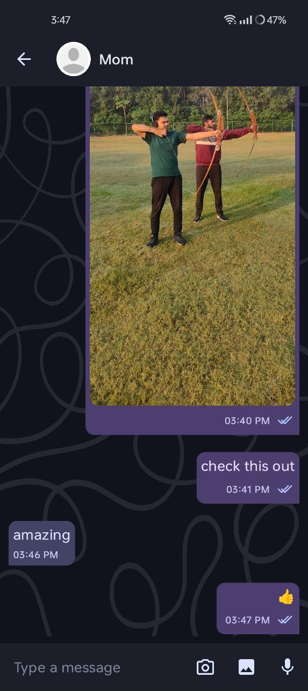

# Chat App 💬🔥

ChatApp is a fast and modern messaging application built using **Jetpack Compose** and **Firebase**. Inspired by WhatsApp and Telegram, the app delivers a smooth chat experience with support for multimedia and real-time communication.

---

## 📷 Screenshots

<!-- Replace with actual screenshots -->

  
  

## 🚀 Features

- ✨ **Beautiful UI** with Jetpack Compose
- 🔐 **OTP Sign-In** using Phone Number
- 🗨️ **Real-time chat** with Firebase Firestore
- 📎 **Multimedia support** (text, images, voice messages)
- 📤 **Image and audio uploads** with Firebase Storage
- ✅ **MVVM Architecture** and **Clean Code Practices**

---

## 🛠️ Tech Stack

- **Kotlin**
- **Jetpack Compose**
- **Koin** for Dependency Injection
- **MVVM + Clean Architecture**
- **Firebase Authentication**
- **Firebase Firestore**
- **Firebase Storage**

---

